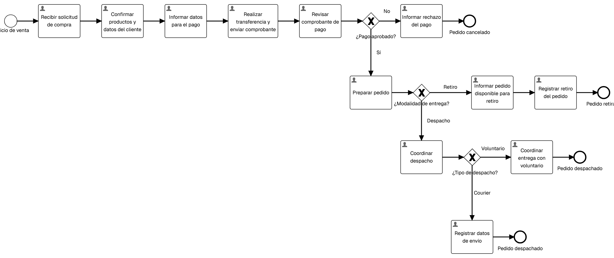
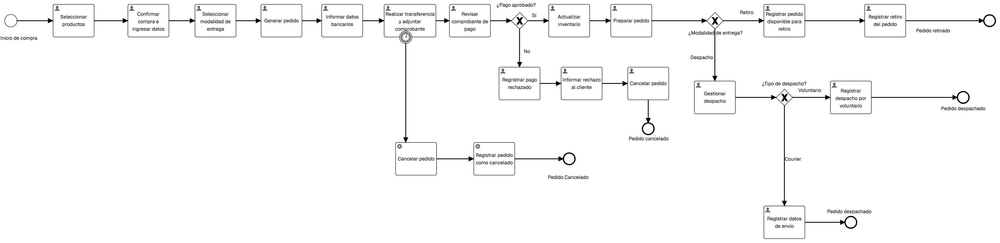

# Mapuescuela - Integración de Plataformas

Producto Mínimo Viable desarrollado para la asignatura **Integración de Plataformas**. La solución digitaliza la gestión de ventas de Mapuescuela mediante una interfaz web, servicios REST, persistencia H2 y un proceso BPMN ejecutable en Flowable.

## Valor del producto

Mapuescuela permite centralizar las principales operaciones del negocio:

- Registrar y consultar pedidos.
- Aprobar o rechazar pagos.
- Preparar pedidos para retiro o despacho.
- Registrar retiros, despachos y cancelaciones.
- Consultar y descontar inventario.
- Conservar pedidos y stock después de reiniciar la aplicación.
- Coordinar el proceso de negocio mediante BPMN y External Workers.

## Arquitectura

La solución se compone de:

1. **Interfaz web:** HTML, CSS y JavaScript servidos por Spring Boot.
2. **API REST:** servicios Java para pedidos e inventario.
3. **Base de datos:** H2 persistente en archivo mediante Spring Data JPA.
4. **Proceso BPMN:** modelo TO-BE desplegado y ejecutado en Flowable.
5. **External Workers:** integración entre las tareas automáticas del BPMN y la API REST.

## Requisitos

- Java 21.
- Git.
- Windows PowerShell o una terminal equivalente.
- Docker Desktop, solo para ejecutar Flowable Open Source localmente.

No es necesario instalar Maven: el repositorio incluye Maven Wrapper.

## Instalación y ejecución del MVP

### 1. Clonar el repositorio

```bash
git clone https://github.com/Zaira-m/mapuescuela-evaluacion1.git
cd mapuescuela-evaluacion1
git checkout examen
```

### 2. Ejecutar las pruebas

En Windows:

```powershell
.\mvnw.cmd test
```

En Linux o macOS:

```bash
./mvnw test
```

El resultado esperado es `BUILD SUCCESS`.

### 3. Iniciar la aplicación

En Windows:

```powershell
.\mvnw.cmd spring-boot:run
```

En Linux o macOS:

```bash
./mvnw spring-boot:run
```

Cuando la terminal muestre `Started MapuescuelaApiApplication`, abrir:

```text
http://localhost:8080
```

## Interfaz web

La interfaz fue diseñada para la operación cotidiana de la emprendedora. Presenta estados y resultados en tarjetas legibles, sin exponer el JSON técnico de la API.

Incluye tres secciones:

### Registrar pedido

- Nombre del cliente.
- Producto.
- Cantidad.
- Modalidad de entrega: retiro o despacho.

### Consultar y actualizar pedido

- Consultar por ID.
- Aprobar o rechazar el pago.
- Marcar como disponible para retiro.
- Registrar retiro o despacho.
- Cancelar el pedido.

### Gestionar inventario

- Consultar stock por producto.
- Descontar unidades.
- Informar stock insuficiente o cantidades inválidas.

## Persistencia H2

Pedidos e inventario se almacenan mediante **Spring Data JPA** en una base H2 persistente:

```text
jdbc:h2:file:./data/mapuescuela
```

Hibernate actualiza automáticamente el esquema y la carpeta local `data/` está excluida de Git. Esto evita publicar datos de ejecución y permite conservar la información después de detener y reiniciar Spring Boot.

Al iniciar por primera vez, el inventario incorpora los siguientes valores si todavía no existen:

- Producto 1: 10 unidades.
- Producto 2: 5 unidades.
- Producto 3: 8 unidades.

## API REST

### Pedidos

| Método | Ruta | Operación |
|---|---|---|
| `POST` | `/api/pedidos` | Registrar pedido |
| `GET` | `/api/pedidos/{id}` | Consultar pedido |
| `PUT` | `/api/pedidos/{id}/pago-aprobado` | Aprobar pago |
| `PUT` | `/api/pedidos/{id}/pago-rechazado` | Rechazar pago |
| `PUT` | `/api/pedidos/{id}/disponible-retiro` | Marcar disponible para retiro |
| `PUT` | `/api/pedidos/{id}/retirado` | Registrar retiro |
| `PUT` | `/api/pedidos/{id}/despachado` | Registrar despacho |
| `PUT` | `/api/pedidos/{id}/cancelar` | Cancelar pedido |

Ejemplo de registro:

```json
{
  "cliente": "Cliente de prueba",
  "producto": "Kit educativo",
  "cantidad": 2,
  "modalidadEntrega": "RETIRO"
}
```

### Inventario

| Método | Ruta | Operación |
|---|---|---|
| `GET` | `/api/inventario/{productoId}` | Consultar stock |
| `PUT` | `/api/inventario/{productoId}/descontar` | Descontar stock |

Ejemplo de descuento:

```json
{
  "cantidad": 2
}
```

## Modelos BPMN

La carpeta `bpmn/` contiene:

- `mapuescuela-as-is.bpmn`: proceso original.
- `mapuescuela-to-be.bpmn`: proceso mejorado y automatizado.
- Imágenes PNG de ambos diagramas.

### Modelo AS-IS



### Modelo TO-BE



El modelo TO-BE contempla tareas humanas, compuertas, temporizador de cancelación, retiro, despacho y tareas automáticas.

## External Workers

Los trabajadores externos desarrollados en Java conectan el BPMN con la API REST:

- `generar-pedido`
- `actualizar-inventario`
- `registrar-pago-rechazado`
- `registrar-cancelacion`
- `pedido-disponible-retiro`
- `registrar-pedido-retirado`
- `registrar-pedido-despachado`

Ningún token se almacena en el repositorio. Para reproducir la integración con Flowable Work Trial se debe configurar un token propio:

```powershell
$env:FLOWABLE_TOKEN="TOKEN_PERSONAL"
.\mvnw.cmd spring-boot:run
```

## Ejecución en Flowable Work Trial

El proceso se ejecutó de principio a fin en Flowable Work Trial, integrando formularios, tareas humanas, compuertas y External Workers.

Rutas validadas:

1. Pago aprobado con retiro.
2. Pago aprobado con despacho por courier.
3. Pago aprobado con despacho por voluntario.
4. Pago rechazado y cancelación.
5. Cancelación automática mediante temporizador.

El archivo `Mapuescuela.zip` corresponde al respaldo exportado desde Flowable e incluye el modelo y los formularios utilizados en Trial.

## Flowable Open Source con Docker

También se validó el BPMN en **Flowable Open Source 6.8.0**.

### Iniciar Flowable

```powershell
docker run -d --name flowable-open-source -p 8081:8080 flowable/flowable-ui:6.8.0
```

Abrir:

```text
http://localhost:8081/flowable-ui
```

Credenciales predeterminadas del entorno local utilizado:

```text
Usuario: admin
Contraseña: test
```

En Open Source se comprobó:

- Importación del BPMN TO-BE.
- Validación `No errors detected`.
- Creación y publicación de la aplicación Mapuescuela.
- Registro de la definición en el motor.
- Inicio de una instancia.
- Creación y avance de tareas humanas.
- Reconocimiento de `Generar pedido` como `externalWorkerServiceTask`.

La imagen `flowable/flowable-ui:6.8.0` utilizada no incorpora el módulo REST independiente `external-job-api`. Por ese motivo, la demostración integral de los siete workers se conserva en Flowable Work Trial, mientras Open Source respalda la portabilidad, validación y ejecución del BPMN en un motor local.

### Detener y volver a iniciar Flowable

```powershell
docker stop flowable-open-source
docker start flowable-open-source
```

## Pruebas realizadas

- Compilación y prueba de contexto con Maven: `BUILD SUCCESS`.
- Registro y consulta de pedidos.
- Pago aprobado, rechazo y cancelación.
- Retiro y despacho.
- Consulta y descuento de inventario.
- Persistencia de pedidos después del reinicio.
- Persistencia del inventario después del reinicio.
- Validación y publicación del BPMN en Flowable Open Source.
- Ejecuciones integrales con External Workers en Flowable Work Trial.

Ejemplo de ruta validada desde la interfaz:

```text
Pendiente -> Pago aprobado -> Disponible para retiro -> Retirado
```

## Evidencias

- `evidencias-api/`: pruebas de los servicios REST.
- `evidencias-flowable/`: formularios y ejecuciones en Flowable Work Trial.
- `evidencias-eva3/`: integración, rutas completas e interfaz de EVA3.
- `evidencias-examen/`: H2, inventario, interfaz pulida y Flowable Open Source.

## Tecnologías utilizadas

- Java 21.
- Spring Boot 4.1.0.
- Spring Data JPA.
- H2 Database.
- Jakarta REST.
- HTML5, CSS3 y JavaScript.
- BPMN 2.0.
- Flowable Work Trial.
- Flowable Open Source 6.8.0.
- Docker Desktop y WSL 2.
- Maven Wrapper.
- Postman.
- Git y GitHub.
- IA generativa como apoyo para revisión, depuración, documentación y mejora de la experiencia de usuario.

## Estructura del repositorio

```text
bpmn/                   Modelos BPMN e imágenes
evidencias-api/         Pruebas de servicios REST
evidencias-flowable/    Ejecuciones en Flowable Work Trial
evidencias-eva3/        Evidencias de la tercera evaluación
evidencias-examen/      Persistencia, interfaz y Open Source
gestion-proyecto/       Planificación y seguimiento
src/main/java/          API, modelos, repositorios y workers
src/main/resources/     Configuración e interfaz web
Mapuescuela.zip          Exportación de Flowable
pom.xml                  Dependencias y compilación
```

## Uso de IA y tecnologías complementarias

Durante el desarrollo se utilizó IA generativa como herramienta de apoyo para:

- Revisar la arquitectura y detectar inconsistencias entre variables BPMN.
- Depurar la integración de External Workers.
- Mejorar validaciones y tratamiento de errores.
- Migrar pedidos e inventario desde memoria a persistencia JPA/H2.
- Diseñar una interfaz web más clara para la emprendedora.
- Estructurar pruebas, evidencias y documentación técnica.

Todas las decisiones fueron verificadas mediante compilación, pruebas REST y ejecuciones reales del proceso.

## Seguridad

- Los tokens se configuran mediante variables de entorno.
- `.env`, archivos locales y secretos están excluidos por `.gitignore`.
- La base H2 generada localmente no se publica.
- No existen credenciales personales en el repositorio.

## Estado del proyecto

- MVP funcional: completado.
- Interfaz web pulida: completada.
- API REST: completada.
- Persistencia H2 para pedidos e inventario: completada.
- BPMN AS-IS y TO-BE: completados.
- Formularios Flowable: completados.
- Siete External Workers: implementados y probados.
- Ejecución integral en Flowable Work Trial: completada.
- Validación y ejecución en Flowable Open Source: completada.
- Evidencias del examen: incorporadas.

## Autora

**Zaira Manriquez**

Asignatura: **Integración de Plataformas**
